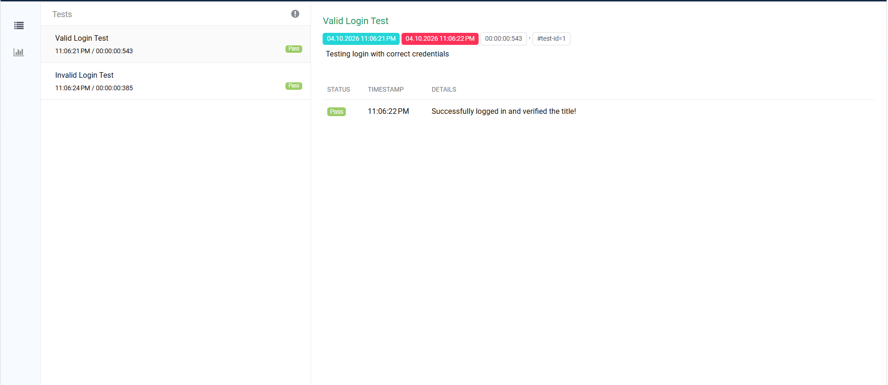
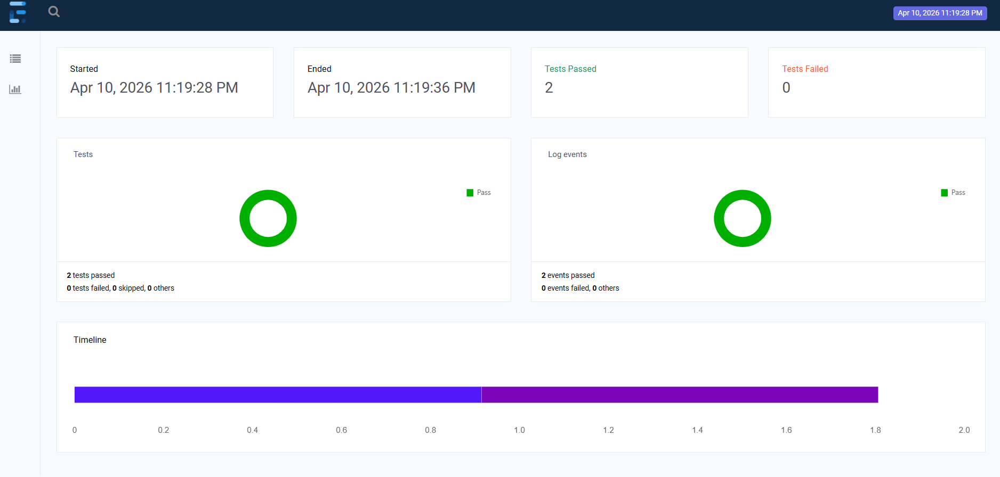
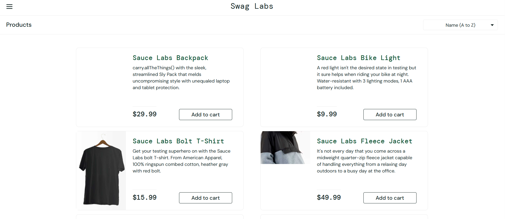

# Selenium Web Automation Framework

This is a professional test automation framework built using **Java** and **Selenium WebDriver**.

### 🛠 Tech Stack
- **Language:** Java
- **Automation Tool:** Selenium WebDriver
- **Test Framework:** TestNG
- **Design Pattern:** Page Object Model (POM)
- **Build Tool:** Maven
- **Reporting:** Extent Reports

### 🚀 Key Features
- Clean and maintainable code using **POM**.
- Detailed HTML reports generated after each run.
- **Automatic Screenshots** captured on test failures.
- Priority-based test execution.

### 📊 Test Execution Reports

#### 1. Automation Dashboard

#### 2. Failure Analysis with Screenshots

